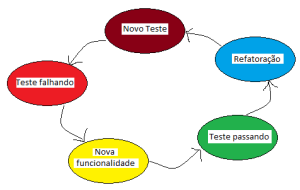
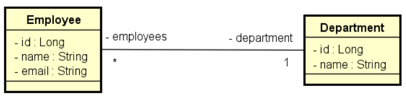

# Test Driven Development

O desenvolvimento guiado pelos testes (**Test Driven Development - TDD**) é uma técnica de desenvolvimento no qual os testes são escritos antes de escrever o código de implementação, no qual existem vantagens quando utilizado.

## Ciclos de Desenvolvimento

Figura 1. Ciclo de desenvolvimento do TDD

## Vantagens

- Feedback rápido sobre a nova funcionalidade e sobre as outras funcionalidades existentes no sistema
- Código mais limpo, já que escrevemos códigos simples para o teste passar
- Segurança na correção de bugs
- Segurança no Refactoring pois podemos ver o que estamos ou não afetando
- Maior produtividade já que o desenvolvedor encontra menos bugs e não

Esse projeto consiste na contrução de uma API onde duas classes que tem uma relação N-1,  precisariam ser implementadas baseadas nos seguintes testes:

## Dependências utilizadas

- Springboot
- Springweb
- H2DB

## Padrão utilizado

- Camadas (repositories, services, controllers)